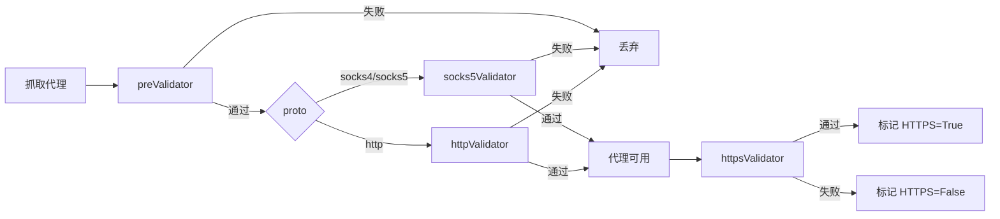

# 扩展校验器 · Extending Validators

## 内置校验 · Built-in Validators

项目中使用的代理校验方法全部定义在 `helper/validator.py` 中，通过 `ProxyValidator` 类中提供的装饰器来区分。校验方法返回 `True` 表示校验通过，返回 `False` 表示校验不通过。

All validators live in `helper/validator.py`, distinguished by decorators on the `ProxyValidator` class. A validator returns `True` on pass and `False` on fail.

代理校验方法分为四类 · There are four validator categories:

| 类型 · Type | 装饰器 · Decorator | 说明 · Description |
|------|--------|------|
| `preValidator` | `@ProxyValidator.addPreValidator` | 预校验，在代理抓取后验证前调用 · pre-check, after fetch before validation |
| `httpValidator` | `@ProxyValidator.addHttpValidator` | 代理可用性校验，通过则认为代理可用 · availability check |
| `httpsValidator` | `@ProxyValidator.addHttpsValidator` | 校验代理是否支持 HTTPS · HTTPS support check |
| `socks5Validator` | `@ProxyValidator.addSocks5Validator` | 校验 SOCKS 代理是否可用（独立于 http/https 链路）· SOCKS availability (separate chain) |

每种校验可以定义多个方法，只有**所有**方法都返回 `True` 的情况下才视为该校验通过。

Multiple methods per category are allowed; a category passes only when **all** its methods return `True`.

### 校验执行顺序 · Validation Flow



- `preValidator` 校验通过的代理才会进入可用性校验 · only proxies passing `preValidator` enter the availability stage
- 校验时按代理的 `proto` 字段分支：`socks4`/`socks5` 走 `socks5Validator` 链路（SOCKS 代理天然支持 CONNECT 隧道，直接标记 `https=True`），`http` 走原有 http/https 链路 · validation branches on `proto`: `socks4`/`socks5` go through `socks5Validator` (SOCKS natively supports CONNECT tunneling, so auto-marked `https=True`), while `http` goes through the http/https chain
- `httpValidator` 校验通过后认为代理可用，更新入代理池 · `httpValidator` pass → proxy marked available and added to pool
- `httpsValidator` 校验通过后视为代理支持 HTTPS，更新代理的 `https` 属性为 `True` · `httpsValidator` pass → proxy's `https` attribute set to `True`

!!! note
    HTTPS 校验默认内置的是**隧道校验** `httpsTunnelValidator`：代理本身统一用 `http://` 连接，目标 URL 的 https 由 requests 自动升级为 CONNECT 隧道；采用「`HTTPS_URL` + `cn.bing.com` 任一 200 即认定」的双目标 OR 逻辑，对冲单目标站点的代理策略差异。详见 `helper/validator.py`。
    The default HTTPS check is the **tunnel validator** `httpsTunnelValidator`: it connects to the proxy via `http://` uniformly, while the target's https is auto-upgraded by requests to a CONNECT tunnel; it uses dual-target OR logic (either `HTTPS_URL` or `cn.bing.com` returning 200 counts as pass) to hedge against single-site proxy policies. See `helper/validator.py`.

## 扩展校验 · Custom Validators

在 `helper/validator.py` 中已有自定义校验的示例，自定义函数需返回 `True` 或者 `False`，使用 `ProxyValidator` 中提供的装饰器来区分校验类型。

`helper/validator.py` already contains examples. A custom validator returns `True`/`False` and declares its category via the `ProxyValidator` decorators.

### 示例 1：自定义代理可用性校验 · Example 1: custom availability check

```python
@ProxyValidator.addHttpValidator
def customValidatorExample01(proxy):
    """自定义代理可用性校验函数"""
    proxies = {"http": "http://{proxy}".format(proxy=proxy)}
    try:
        r = requests.get("http://www.baidu.com/", headers=HEADER, proxies=proxies, timeout=5)
        return True if r.status_code == 200 and len(r.content) > 200 else False
    except Exception as e:
        return False
```

### 示例 2：自定义 HTTPS 校验 · Example 2: custom HTTPS check

```python
@ProxyValidator.addHttpsValidator
def customValidatorExample02(proxy):
    """自定义代理是否支持 HTTPS 校验函数"""
    proxies = {"https": "https://{proxy}".format(proxy=proxy)}
    try:
        r = requests.get("https://www.baidu.com/", headers=HEADER, proxies=proxies, timeout=5, verify=False)
        return True if r.status_code == 200 and len(r.content) > 200 else False
    except Exception as e:
        return False
```

### 示例 3：自定义 SOCKS5 校验 · Example 3: custom SOCKS5 check

```python
@ProxyValidator.addSocks5Validator
def customSocks5Validator(proxy):
    """自定义 SOCKS5 代理可用性校验函数"""
    proxies = {"http": "socks5h://{proxy}".format(proxy=proxy),
               "https": "socks5h://{proxy}".format(proxy=proxy)}
    try:
        r = requests.head("http://www.baidu.com", headers=HEADER,
                          proxies=proxies, timeout=5, verify=False)
        return True if r.status_code == 200 else False
    except Exception:
        return False
```

`socks5h://` scheme 让 SOCKS5 代理自己做 DNS 解析（等价于 `curl --socks5h`），避免本地 DNS 劫持导致「代理好但域名解析不通」的假阴性。

The `socks5h://` scheme makes the SOCKS5 proxy resolve DNS itself (equivalent to `curl --socks5h`), avoiding false negatives from local DNS hijacking.

!!! note
    在运行代理可用性校验时，所有被 `ProxyValidator.addHttpValidator` 装饰的函数会依次按定义顺序执行，只有当所有函数都返回 `True` 时才会判断代理可用。`HttpsValidator`、`Socks5Validator` 运行机制也是如此。
    During validation, all functions decorated with `@ProxyValidator.addHttpValidator` run in definition order; the proxy is usable only when all return `True`. The same applies to `HttpsValidator` and `Socks5Validator`.